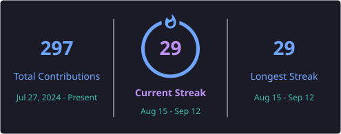

# Hey everyone, here's your loved Ayush Sharma. 😎

### **Building things, failing, learning from those failures, and improving every day.**

I'm a **B.Tech Computer Engineering student @ Marwadi University, Semester 5.**

I work on projects that solve real-world problems, add value to people's lives, and help me learn by actually building things.

I also run an **eSports organization on the side.**

>  Not open for free-work opportunities.
>  If you're building something real, **let's talk. I'm always open to building something meaningful together.**

---

##  What I Work With

### Languages

### Frontend

### Backend & Database

### AI / LLMs

### Tools & Deployment

---

# GitHub Stats

  
  
  

---

# Projects

| Project                                                                                             | Status         | Stack                       | Links                                                                                              |
| --------------------------------------------------------------------------------------------------- | -------------- | --------------------------- | -------------------------------------------------------------------------------------------------- |
| 🔧 **BoringTools** — 100 Days, 100 Tools. Browser-first micro-utilities, no signup, no fluff.       | ✅ Done         | Next.js · Tailwind · Vercel | [Live](https://boring-tools-nine.vercel.app/) · [Repo](https://github.com/ius-sharma/boring-tools) |
|  **YT Shorts Clipper** — Turns a YouTube video into ready-to-post Shorts automatically.           | 🔨 In Progress | Python · FastAPI · Next.js  | Coming soon                                                                                        |
|  **ArrowGoPlus** — Feature-rich Arrow Puzzle clone with cloud saves, leaderboards & level editor. | 🔜 Up Next     | ASP.NET Core MVC · .NET 8   | Coming soon                                                                                        |

---

# Beyond Code

## Founder of [**ODDSOCEAN**](https://oddsocean.in/)

An eSports organization built for the **underdogs**.

We're building toward a gaming ecosystem where talented players and creators get opportunities to **grow, compete, and build something bigger.**

---

# Let's Connect

  
  
  
  

---

### 💭 *Build → Fail → Learn → Improve → Repeat.*

  <i>Thanks for stopping by.</i>

